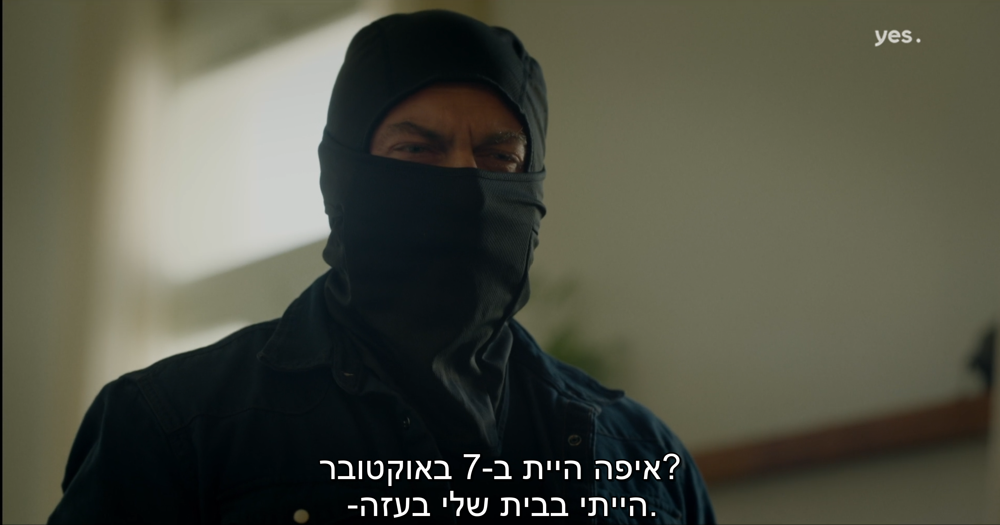

# Multilingual Subtitle Translator

Automatic Hebrew-first subtitles for videos with mixed-language audio
(Hebrew + Arabic + French out of the box, easily extensible). Built on
[faster-whisper](https://github.com/SYSTRAN/faster-whisper) for
transcription and [deep-translator](https://github.com/nidhaloff/deep-translator)
(Google Translate) for translation.

Runs natively on Windows/Linux/macOS, or in Docker with auto-detected
CPU/GPU images.


---



> Auto-generated Hebrew subtitles overlaid on an Arabic-language scene.
> Frame from *Fauda* (yes Studios), included for technology-demonstration
> purposes only — all rights to the source video belong to their respective
> owners.

---

## Why

Most bilingual shows (Fauda, Tehran, In Treatment, foreign-language drama
in general) have only one official subtitle track — usually in the source
producer's language. If you want subtitles in *your* language and the
content code-switches between several languages mid-scene, off-the-shelf
auto-subtitle tools fail badly: forcing a single language at Whisper makes
it hallucinate on the other-language stretches (the infamous
`"اشتركوا في القناة"` loop, or the `"Thanks for watching"` loop in English).

This pipeline solves it by transcribing each candidate language
*independently* and then picking the higher-confidence transcription per
time slice, with explicit anti-hallucination guards.

## How it works

```
┌────────────┐  ffmpeg   ┌─────────────────┐
│   video    │ ────────▶ │ 16 kHz mono WAV │
└────────────┘           └────────┬────────┘
                                  │
              ┌───────────────────┼───────────────────┐
              ▼                   ▼                   ▼
   ┌──────────────────┐  ┌──────────────────┐  ┌──────────────────┐
   │ Whisper pass: he │  │ Whisper pass: ar │  │ Whisper pass: fr │
   │ + guards         │  │ + guards         │  │ + guards         │
   └────────┬─────────┘  └────────┬─────────┘  └────────┬─────────┘
            └────────────────────┬┴────────────────────┘
                                 ▼
                ┌─────────────────────────────────┐
                │ Merge by per-segment confidence │
                │ (avg_logprob − hallucination    │
                │  penalty), boundary-walked      │
                └────────────────┬────────────────┘
                                 ▼
                ┌─────────────────────────────────┐
                │ For each non-Hebrew pick:       │
                │   Google Translate → Hebrew     │
                └────────────────┬────────────────┘
                                 ▼
                ┌─────────────────────────────────┐
                │  RTL-marked .he.srt             │
                └─────────────────────────────────┘
```

**Anti-hallucination guards used in every pass:**
- `condition_on_previous_text=False` — stops loops where one bad token poisons the next
- `repetition_penalty=1.15`
- `no_speech_threshold=0.6`, `compression_ratio_threshold=2.4`, `log_prob_threshold=-1.0`
- Temperature fallback ladder `[0.0, 0.2, 0.4, 0.6, 0.8, 1.0]`
- VAD with `min_silence_duration_ms=500`
- Post-hoc penalty for known hallucination phrases ("Subscribe to the channel" etc.)

**Merging** walks the union of segment boundaries from all passes; for each
sub-interval, the candidate with the highest `avg_logprob − penalty` wins.

## Quick start

### Docker (recommended — works anywhere)

```bash
# Linux / macOS
./run-docker.sh path/to/show.mkv

# Windows
.\run-docker.ps1 path\to\show.mkv
```

The launcher auto-detects whether you have an NVIDIA GPU and picks the right
image. First run pulls the pre-built image from
[GHCR](https://github.com/ShyTech1/multilingual-subtitle-translator/pkgs/container/multilingual-subtitle-translator)
and downloads the Whisper model (~1.5 GB). Both are cached afterwards.
Set `TRANSLATOR_BUILD_LOCAL=1` to build the image locally instead.

See [`docker/README.md`](docker/README.md) for full details, including
`docker compose` usage.

### Native (no Docker)

Requires Python 3.10+ and (optionally) an NVIDIA GPU.

```bash
python -m venv .venv
source .venv/bin/activate   # Windows: .venv\Scripts\activate
pip install -r requirements.txt

# Optional: GPU acceleration
pip install nvidia-cublas-cu12 'nvidia-cudnn-cu12==9.*'

python subtitle.py path/to/show.mkv
```

On Windows you can also just drag any video onto `run.bat`.

### Output

For an input `show.mkv` you get three files alongside it:

| File | Purpose |
|---|---|
| `show.he.srt` | The merged, translated, RTL-marked Hebrew subtitle file |
| `show.he.raw.srt` | Raw Hebrew-pass output (for comparison/debugging) |
| `show.ar.raw.srt` | Raw Arabic-pass output (for comparison/debugging) |
| `show.audio16k.wav` | Extracted audio cache (safe to delete after; speeds up reruns) |

Open `show.mkv` in VLC — `show.he.srt` is auto-loaded because it shares the
base name.

## CLI

```
python subtitle.py <video> [options]

  --model MODEL          Whisper model: tiny, base, small, medium, large-v3
                         (default: medium)
  --device {cuda,cpu,auto}  Inference device (default: cuda)
  --compute-type TYPE    ctranslate2 compute type. int8_float16 uses ~half the
                         VRAM of float16 with minimal quality loss (default).
  --beam-size N          Beam search width. Lower = less VRAM (default: 2)
  --languages LIST       Comma-separated language codes to run passes for
                         (default: he,ar,fr). Non-Hebrew picks get translated
                         to Hebrew.
```

Utilities:

| Script | What it does |
|---|---|
| `subtitle.py` | Full pipeline (extract → transcribe × N → merge → translate → write) |
| `translate_srt.py` | Re-translate an existing `.srt`: finds Arabic blocks, sends them to Google Translate. Useful when the first run's translation step failed (e.g. SSL/network). |
| `rtl_srt.py` | Prefix every subtitle line with a `U+200F` Right-to-Left Mark for cleaner RTL rendering. |

## Performance reference

Numbers from a 45-minute episode of a bilingual show on an RTX 3060 (12 GB)
+ i7-12700K:

| Setup | Model | Per pass | Total (3 passes + merge + translate) |
|---|---|---|---|
| GPU `int8_float16` | medium | ~70 s | ~5–8 min |
| GPU `float16` | medium | ~50 s | ~4–6 min |
| GPU `float16` | large-v3 | ~3 min | ~12 min (needs ~5 GB VRAM) |
| CPU `int8` | medium | ~25 min | ~80–90 min |

## Notable design choices

- **Pre-extract audio with ffmpeg.** PyAV (which faster-whisper uses
  internally) tries to buffer the entire audio stream in memory and OOMs on
  large MKVs (~2 GB+). Decoding to a separate 16 kHz mono WAV (~80 MB for a
  45 min show) sidesteps this and makes reruns instant.
- **Two-image Docker strategy.** A unified CPU+GPU image either bloats CPU
  users with a useless 4 GB of CUDA libraries or forces GPU users to
  install them post-hoc. Two thin images + a launcher that picks at
  runtime is cleaner.
- **Shared HuggingFace cache volume.** Whisper models are 1.5–3 GB. They're
  mounted from `~/.cache/huggingface` so the same download is shared
  between native runs, the CPU image, and the GPU image.
- **`truststore` for translation.** Corporate networks and many antivirus
  products MITM HTTPS with their own root CA, breaking `certifi`-based
  TLS. `truststore` uses the OS certificate store and Just Works.
- **`U+200F` RTL marks** on every Hebrew line so that mixed-script lines,
  leading punctuation, and numbers render in the correct visual order
  regardless of player.

## Limitations

- Translation goes via Google Translate's free web endpoint — no API key
  needed, but rate-limited and occasionally returns "no translation found"
  for short fragments (handled with a per-line fallback).
- Speaker dialect strongly affects accuracy: classical/MSA Arabic is
  excellent on `medium`; heavy colloquial Levantine Arabic is meaningfully
  better on `large-v3`.
- Whisper is told one language per pass; truly novel mid-utterance
  code-switching can still be missed.

## License

MIT — see [LICENSE](LICENSE).
